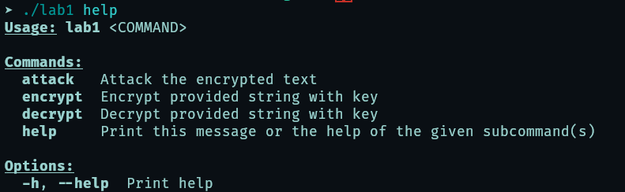
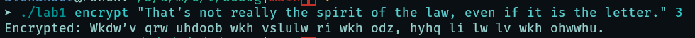
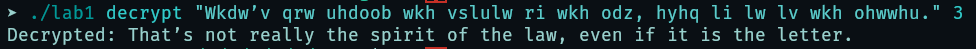
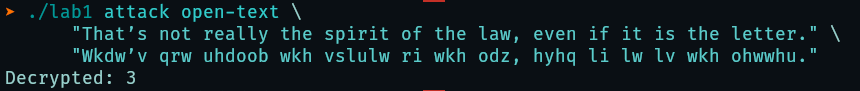
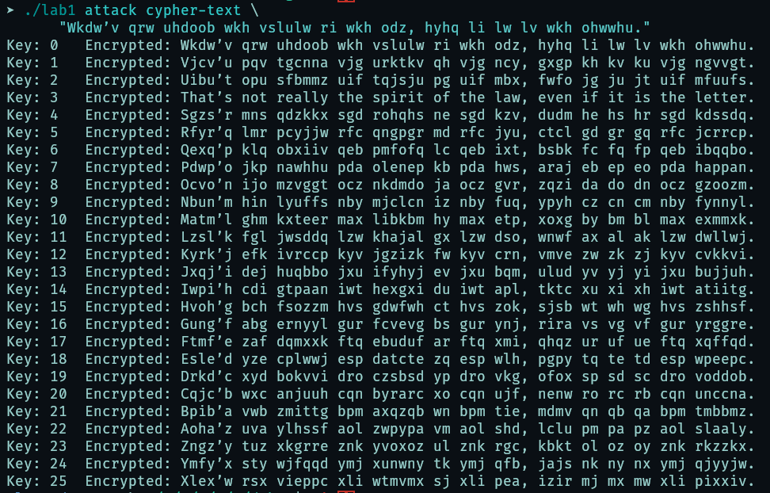
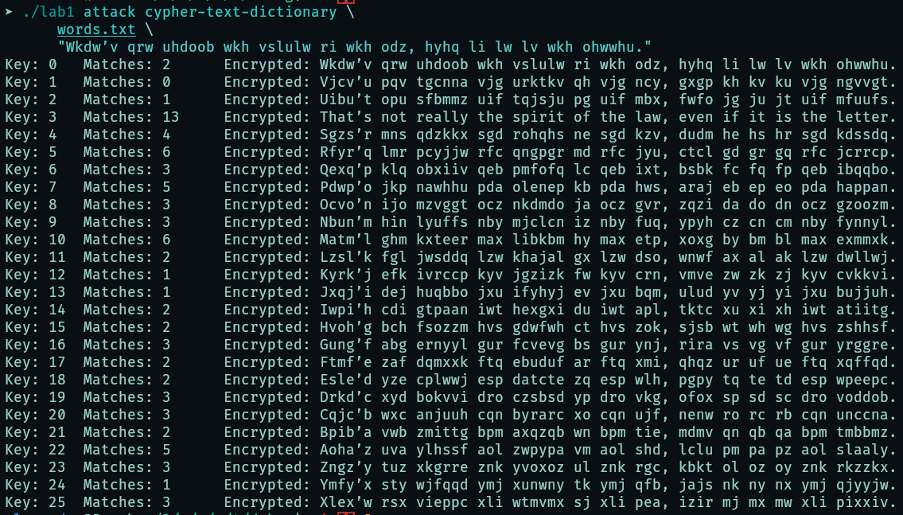

### help

### Шифрование

### Расшифрование

### Атака по известному и зашифрованному тексту

### Атака перебором

### Атака перебором со словарём

Словарь слов взят [отсюда](https://github.com/first20hours/google-10000-english/tree/master).

